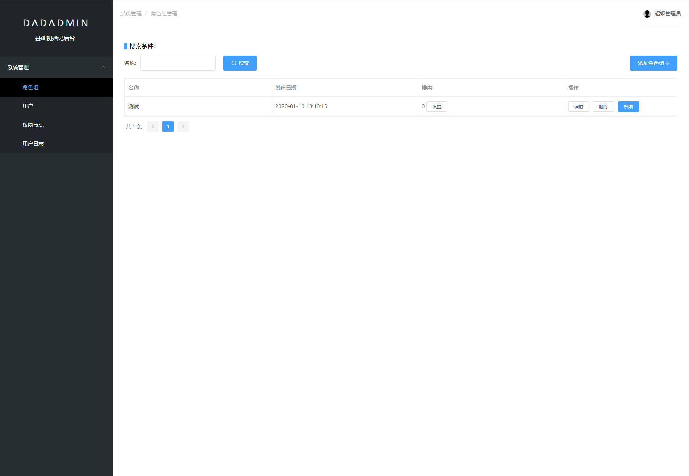

# dadadmin_vue

### 介绍
#####1.该项目是dadadmin前端项目，后端是：dadadmin_php

#####2.dadadmin是为了解决很多的外包项目每次都要初始化一个后台而诞生的，我把最基本的用户管理，角色组管理，权限（rbac），操作日志等功能抽离出来，打包成了dadadmin

#####3.dadadmin是一个后台管理的初始脚手架，包含了最基本的用户管理，角色组管理，权限（rbac），操作日志等功能。
#####4.dadadmin是一个快速，直接拿来开始一个新项目的起点。你可以用它来初始化一个后台管理平台，在此基础上，你可以添加任何其他的业务功能模块。
#####5.dadadmin采用了php api + vue 的前后端分离架构，其中php使用了thinkphp 3.2 框架，vue使用了vue2 + elementui
#####6.dadadmin为解决很多的外包项目每次都要初始化一个后台提供了很好的支持
####7.安装需要:
####后端项目：
#####php7.1+ mysql 5.6+  redis 
#####下载后端项目，然后composer install，然后把项目根目录下的dadadmin.sql导入到mysql，然后配置web服务指向项目，保证网络可访问到backapp目录下的index.php

####前端项目：
#####下载前端（dadadmin_vue）项目，然后npm i，然后使用vue脚手架 vuecli，运行命令，npm run serve,即可

